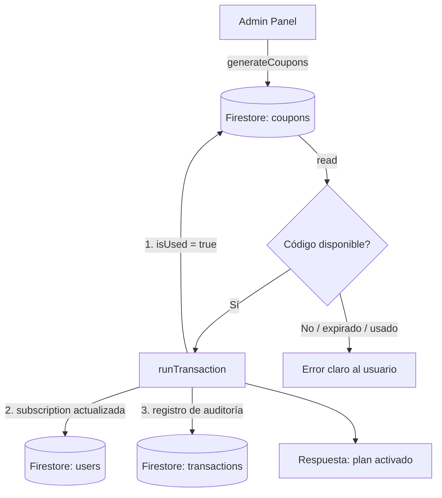

# 🎟️ Sistema de Códigos de Acceso Promocional — SaberPro

> **Versión**: 1.0 | **Estado**: Producido y desplegado en `main` | **Fecha**: Marzo 2026

---

## Tabla de Contenidos

1. [Objetivo del Sistema](#objetivo-del-sistema)  
2. [Arquitectura General](#arquitectura-general)  
3. [Archivos Involucrados](#archivos-involucrados)  
4. [Esquema de Base de Datos (Firestore)](#esquema-de-base-de-datos-firestore)  
5. [Flujo Administrativo — Generar Códigos](#flujo-administrativo--generar-códigos)  
6. [Flujo del Estudiante — Canjear Código](#flujo-del-estudiante--canjear-código)  
7. [Modelo de Seguridad](#modelo-de-seguridad)  
8. [Motor de Explicación IA — Mejoras](#motor-de-explicación-ia--mejoras)  
9. [Reglas de Firestore Recomendadas](#reglas-de-firestore-recomendadas)  
10. [Guía de Operación para Administradores](#guía-de-operación-para-administradores)

---

## Objetivo del Sistema

Permite que el equipo de SaberPro genere **códigos únicos de acceso temporal o permanente a planes premium** (Pro / Docente) sin pasar por el flujo de pago. Se usa para:

- Campañas de marketing y adquisición de usuarios.
- Alianzas académicas con instituciones.
- Demos para colegios o universidades.
- Premios en eventos o competencias.

> [!IMPORTANT]
> Cada código es de **un solo uso**. Una vez canjeado, queda inhabilitado y se registra en el log de auditoría.

---

## Arquitectura General



La operación de canje es **atómica** (Firestore `runTransaction`). No es posible que dos usuarios rediman el mismo código simultáneamente.

---

## Archivos Involucrados

| Archivo | Rol |
| :--- | :--- |
| `services/finance/subscription.service.ts` | Lógica de negocio: `generateCoupons`, `redeemCoupon` |
| `app/admin/finance/coupons/page.tsx` | UI administrativa para generar y ver el inventario |
| `app/admin/finance/page.tsx` | Dashboard financiero (botón de acceso a cupones) |
| `app/admin/components/AdminSidebar.tsx` | Enlace de navegación en el panel lateral |
| `app/pricing/page.tsx` | Sección de canje para el estudiante |
| `app/api/explain/route.ts` | API de IA con soporte mejorado para respuestas abiertas |
| `types/finance.ts` | Interfaz TypeScript `Coupon` |

---

## Esquema de Base de Datos (Firestore)

### Colección: `coupons`

El **ID del documento** es el mismo código alfanumérico (ej: `X8J2K9L4`).

```json
{
  "code":        "X8J2K9L4",
  "plan":        "pro",
  "isUsed":      false,
  "usedBy":      null,
  "usedAt":      null,
  "createdAt":   Timestamp,
  "expiresAt":   null,
  "description": "Promo Admin - 11/3/2026"
}
```

| Campo | Tipo | Descripción |
| :--- | :--- | :--- |
| `code` | `string` | Código en mayúsculas. Espejea el ID del doc. |
| `plan` | `"pro" \| "teacher"` | Plan que otorga el código al ser canjeado. |
| `isUsed` | `boolean` | `true` después de ser redimido. |
| `usedBy` | `string \| null` | `uid` del usuario que lo redimió. |
| `usedAt` | `Timestamp \| null` | Momento exacto del canje. |
| `createdAt` | `Timestamp` | Fecha de generación. |
| `expiresAt` | `Timestamp \| null` | Fecha de vencimiento opcional. `null` = sin vencimiento. |
| `description` | `string` | Etiqueta interna para identificar la campaña. |

### Registro de Auditoría en `transactions`

Cada canje exitoso genera una entrada con ID `COUPON-{CODE}-{timestamp}`:

```json
{
  "userId":   "uid_del_usuario",
  "amount":   0,
  "currency": "COP",
  "plan":     "pro",
  "status":   "completed",
  "provider": "PromoSystem",
  "method":   "Access Code",
  "createdAt": Timestamp,
  "metadata": { "couponCode": "X8J2K9L4" }
}
```

---

## Flujo Administrativo — Generar Códigos

**Ruta**: `Admin Panel → Gestión → Códigos de Acceso` (`/admin/finance/coupons`)

### Pasos:

1. Ingresar la **cantidad** de códigos a generar (Ej: `10`).
2. Seleccionar el **plan** a otorgar: *Plan Pro* o *Plan Docente*.
3. Hacer clic en **"Crear N Códigos"**.
4. La tabla se actualiza automáticamente con los nuevos códigos en estado **Disponible**.
5. Pasar el cursor sobre un código y hacer clic en el ícono de **copiar** para obtener el código.

```typescript
// Internamente llama a:
await generateCoupons(count, plan, `Promo Admin - ${fecha}`);
```

### Algoritmo de Generación

```typescript
const code = Math.random().toString(36).substring(2, 10).toUpperCase();
// Ejemplo de salida: "X8J2K9L4"
```

> [!TIP]
> Para mayor seguridad en campañas grandes, se puede extender la longitud del código a 12 caracteres modificando `.substring(2, 14)`.

---

## Flujo del Estudiante — Canjear Código

**Ruta**: Página de Precios (`/pricing`) → sección "¿Tienes un código de acceso?"

### Pasos:

1. El estudiante navega a `/pricing`.
2. Ingresa el código en el campo de texto (auto-convertido a mayúsculas).
3. Hace clic en **"Canjear"**.
4. El sistema valida y actualiza su cuenta en tiempo real.
5. Es redirigido a `/dashboard?promo_success=true`.

### Validaciones (en orden):

```
1. ¿El código existe en Firestore?   → NO → "El código ingresado no existe."
2. ¿Ya fue utilizado?                → SÍ → "Este código ya ha sido utilizado."
3. ¿Tiene fecha de vencimiento?      → EXPIRADO → "Este código ha expirado."
4. Todo OK → Activar plan de forma atómica.
```

---

## Modelo de Seguridad

### Atomicidad (Anti-Doble-Uso)

La operación de canje usa `runTransaction` de Firestore SDK, que:

- Lee y verifica el documento del cupón bajo bloqueo optimista.
- Si otro usuario intenta redimir el mismo código en milisegundos de diferencia, **la segunda operación falla automáticamente** antes de escribir.
- El documento solo se actualiza si **todas** las condiciones son válidas.

### Auditoría

Cada redención queda trazada en la colección `transactions` con:
- ID único determinístico (`COUPON-CODE-TIMESTAMP`)
- `userId` del beneficiario
- Monto `$0` (distinción clara de transacciones pagadas)
- Proveedor `PromoSystem` (distinguible del gateway de pago real)

### Acceso al Panel

El panel de generación está protegido por `AdminLayout`, que valida la variable de entorno `NEXT_PUBLIC_ADMIN_EMAILS` antes de renderizar. Un usuario no-admin es redirigido a `/dashboard`.

> [!CAUTION]
> No exponer el endpoint `generateCoupons` mediante una API pública. La generación debe ocurrir **siempre desde el panel admin autenticado**.

---

## Motor de Explicación IA — Mejoras

Durante el mismo sprint se realizaron mejoras al motor de retroalimentación IA:

### Soporte para Preguntas Abiertas (`isPromptOnly`)

| Tipo de Pregunta | Comportamiento de la IA |
| :--- | :--- |
| **Opción Múltiple** | Evalúa correcta/incorrecta, explica la lógica y da analogía según carrera |
| **Respuesta Abierta** | Analiza el texto del estudiante, da feedback de argumentación y sugiere respuesta ideal |

### Personalización por Carrera

El prompt de IA incluye el `targetCareer` del perfil del usuario para generar explicaciones más relevantes. Ejemplo:

```
Si el estudiante estudia "Medicina", la analogía usará conceptos médicos.
Si estudia "Ingeniería Industrial", se usarán ejemplos de procesos o sistemas.
```

### Schema Zod Actualizado (`app/api/explain/route.ts`)

```typescript
question: z.object({
    text: z.string().min(1),
    isPromptOnly: z.boolean().optional(), // ← Nuevo campo
}),
```

---

## Reglas de Firestore Recomendadas

Agregar a `firestore.rules` para proteger la colección de cupones:

```javascript
// Solo admins pueden CREAR o LISTAR cupones
match /coupons/{couponId} {
  allow read: if request.auth != null; // Cualquier usuario autenticado puede leer (para canjear)
  allow write: if request.auth.token.email in ['admin@ejemplo.com']; // Solo admin puede crear
  allow update: if request.auth != null 
    && request.resource.data.isUsed == true 
    && request.resource.data.usedBy == request.auth.uid; // Solo el usuario que canjea puede actualizar
}
```

> [!NOTE]
> Para mayor robustez en producción, la lógica de validación debería moverse a una **Cloud Function**, removiendo los permisos de escritura del cliente completamente.

---

## Guía de Operación para Administradores

### ¿Cómo crear códigos para una campaña?

```
1. Ir a Panel Admin → Gestión → Códigos de Acceso
2. Definir cantidad (ej: 50 para una universidad)
3. Elegir plan (Pro para estudiantes, Docente para profesores)
4. Clic en "Crear 50 Códigos"
5. Exportar los códigos copiándolos uno a uno o desde Firestore Console
6. Distribuir por correo, WhatsApp o landing page de campaña
```

### ¿Cómo verificar si un código fue usado?

En el inventario de la página de cupones, cada código muestra:
- 🟢 **Disponible** — Listo para ser canjeado.
- 🔴 **Usado** — Ya fue redimido (el campo `usedBy` en Firestore tendrá el UID del beneficiario).

### ¿Cómo agregar vencimiento a los códigos?

Actualmente `expiresAt` se guarda como `null`. Para activar fechas de expiración, modificar en `generateCoupons`:

```typescript
// Ejemplo: códigos que expiran en 30 días
expiresAt: new Date(Date.now() + 30 * 24 * 60 * 60 * 1000)
```

---

*Documento generado por el Agente Desarrollador SaberPro · Marzo 2026*
